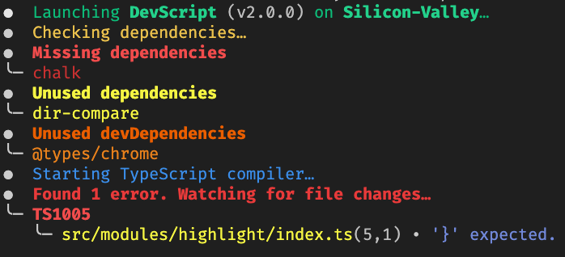

# DevScript
Simple development script to make working with **TypeScript** projects easy.
<br>


## Why

I wrote this script to simplify my TypeScript workflow as I like to have all my files organised and hate having multiple terminals open at the same time.<br>
This script copies and compiles everything in `src` to `out` and then runs the file.<br>
It also automatically restarts the file on file additions, changes and deletions.<br>

## Installation

```bash
# global
npm i -g ts-devscript

# npm
npm i -D ts-devscript

# yarn
yarn add -D ts-devscript
```

## Usage

```bash
# if global
devScript

# if local
npx devScript
```

## Configuration

### Possile Arugments
**Note:** These arguments can also be used in your `package.json` file, simply add the `devScript` property to the root of the `package.json` and use them as key-value pairs.

| Options          | Type      | Description                                                       | Default         |
| ---------------- | --------- | ----------------------------------------------------------------- | --------------- |
| --help           |           | Shows the help command of devScript.                              |                 |
| --src            | `string`  | Directory containing the source code.                             | `src`           |
| --out            | `string`  | Directory that will contain the output.                           | `dist`          |
| --deleteObsolete | `boolean` | Whether or not to delete files from out that are not in the src.  | `true`          |
| --tsconfig       | `string`  | Path to a valid `tsconfig.json` file.                             | `tsconfig.json` |
| --entry          | `string`  | Entry file to be executed after compilation.                      | `index.js`      |
| --depCheck       | `boolean` | Whether or not to check the dependencies.                         | `true`          |
| --copyOnly       | `boolean` | Whether or not only to copy the files from src to out.            | `false`         |
| --ignore         | `string`  | Files that should be ignored when watching files. (glob pattern)  |                 |
| --include        | `string`  | Files that should be included when watching files. (glob pattern) |                 |
| --silent         | `boolean` | Whether or not to print console logs.                             | `false`         |